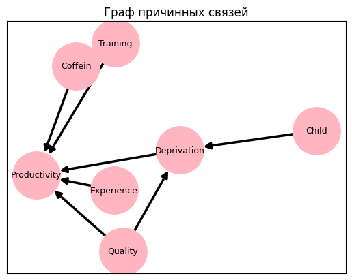
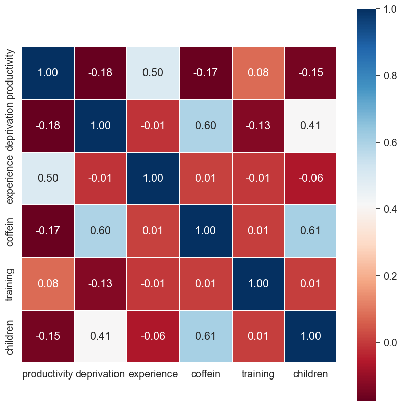
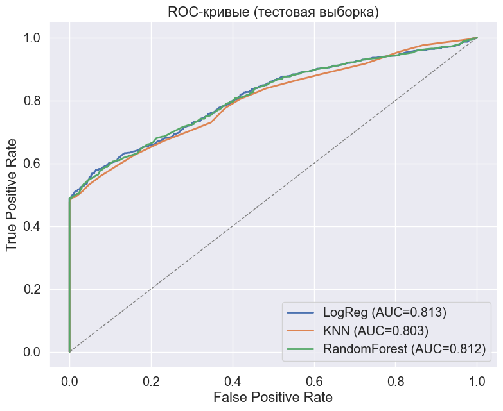
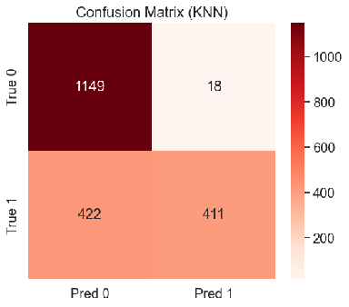
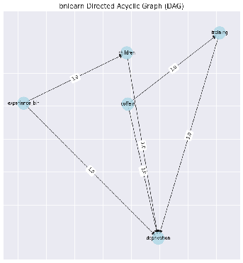
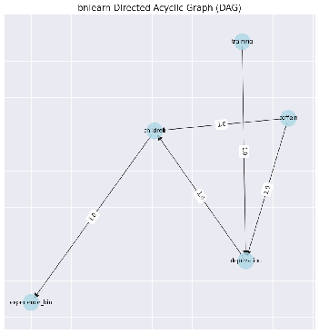
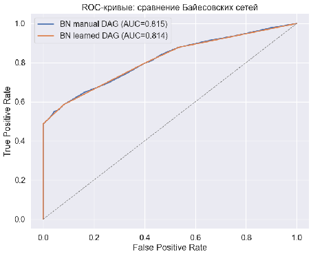
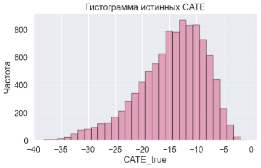

# Причинный анализ депривации сна и производительности труда

## TL;DR

- Вопрос: можно ли корректно оценить эффект депривации сна на производительность, если человек сам решает, сколько спать, а не рандомизированный эксперимент лишает его сна.
- Данные полностью синтетические (10 000 наблюдений), с ненаблюдаемым конфаундером «качество сна» и известным истинным эффектом — это позволяет сравнивать методы не только между собой, но и с истинной величиной эффекта.
- Истинный ATE = −14,82 (около трети средней производительности по выборке). Наивное сравнение «спал мало» vs «спал много» даёт −7,21 — почти вдвое меньше.
- Методы, опирающиеся на условную независимость (МНК, S/T/X-learner, IPW, двойная устойчивость, обычное DML), занижают эффект в 3–8 раз, а IPW при этом меняет знак.
- Единственный метод, который сдвигается в верном направлении — двойное машинное обучение с инструментальной переменной (LATE = −7,84 против истинных −16,13), но и оно упирается в несовершенство самого инструмента.

Учебный проект по машинному обучению и причинному выводу. 

Исследовательский вопрос проекта:: если человек сам решает, высыпаться ему или нет, а не экспериментатор случайным образом лишает его сна, можно ли вообще корректно оценить, насколько недосып бьёт по производительности? Pilcher и Huffcutt ещё в 1996 году по итогам 19 экспериментов показали, что депривация сна ухудшает работоспособность практически по всем направлениям, а Gibson и Shrader в 2018-м на реальных данных о времени заката оценили, что дополнительный час сна поднимает заработок на 1–5%. Но между контролируемым экспериментом и наблюдательными данными о зарплатах лежит эндогенность: качество сна не наблюдается ни в одном датасете, а оно одновременно определяет и склонность к депривации, и продуктивность. Человек с хорошим качеством сна высыпается за номинально короткое время и остаётся эффективным, поэтому простое сравнение «спал мало» против «спал много» будет систематически смещённым.

Чтобы проверить, какие методы сохраняют адекватность оценок при нарушении условной независимости, я сгенерировал синтетические данные с известным истинным эффектом — 10 000 наблюдений, seed 123. В отличие от реальных данных, здесь известен настоящий эффект депривации на каждого работника, поэтому оценки методов можно сравнивать не только между собой, но и с истинным значением эффекта, известным из процесса генерации данных.

Весь код — в ноутбуке этого репозитория.

## Гипотеза

H0: депривация сна не влияет на производительность труда или влияет положительно.
H1: депривация сна снижает производительность труда.

В основе гипотезы — механизм, многократно описанный в литературе по сну: недосып бьёт по устойчивости внимания, рабочей памяти и исполнительным функциям (Lim, Dinges, 2010), из-за чего человек медленнее реагирует, чаще ошибается и хуже держит концентрацию в течение рабочего дня.

## Как устроены данные

### Причинная структура

Ключевая идея процесса генерации в том, что качество сна не наблюдается. Оно не попадает ни в один из признаков модели, но одновременно повышает шанс депривации и способствует более высокой производительности при её отсутствии — именно через него и возникает эндогенность. Инструмент (наличие ребёнка до 3 лет) влияет на производительность только через депривацию, что и делает его инструментом.

### Переменные

- **Производительность** (целевая, непрерывная) — задана парой потенциальных исходов для состояний "с депривацией" и "без", каждый зависит от стажа, кофе и (ненаблюдаемо) качества сна, плюс случайный шум. Снизу ограничена нулём.
- **Депривация сна** (воздействие, бинарная) — 1, если работник спит меньше 7 часов. Вероятность задана логистической функцией от качества сна, стажа, спорта, кофе и инструмента — порог, а не линейная связь.
- **Качество сна** (ненаблюдаемый конфаундер) — из χ²-распределения (8 степеней свободы), обрезано до диапазона 1–99. В признаки моделей не попадает нигде и никогда.
- **Наличие ребёнка до 3 лет** (инструмент, бинарная) — вероятность задана пробит-моделью от стажа, спорта и кофе.
- Контрольные переменные: **стаж** (гамма-распределение, скошено вправо, обрезано до 0,5–50 лет, среднее около 10 — ориентир на реальные данные Росстата), **регулярные занятия спортом** (Бернулли, p = 0,55) и **кофе больше трёх чашек в день** (Бернулли, p = 0,2).

По этому процессу сгенерировано 10 000 наблюдений, разбитых на обучающую и тестовую выборки в пропорции 80/20. Средняя производительность в выборке — 43,74 (медиана 41,49, максимум 149,22), средний стаж — 10,08 лет. Депривацию испытывают 41,4% работников, кофе злоупотребляют 20,1%, спортом занимаются 55,2%, маленький ребёнок есть у 39,9%.

## Корреляции

Инструмент ожидаемо сильно связан с депривацией (0,41), это и обеспечивает его релевантность. Сама депривация отрицательно связана с производительностью (−0,18), что уже на уровне сырых данных намекает на верное направление эффекта. Кофе при этом отрицательно коррелирует и с депривацией, и с производительностью, хотя по замыслу должен был действовать в обе стороны положительно: судя по всему, злоупотребление кофеином (порог задан жёстко, больше трёх чашек) само по себе выступает косвенным маркером накопленной усталости.

## Классификация депривации сна

Три базовые модели (логистическая регрессия, случайный лес и kNN) предсказывают депривацию по стажу, спорту и кофе на входе (без ненаблюдаемого качества сна). Без тюнинга случайный лес переобучается (0,813 на трейне против 0,764 на тесте). После ограничения глубины через GridSearchCV все три модели сходятся к accuracy около 0,787 — по сути, к общему потолку, который задаёт сам процесс генерации данных. По F1 картина хуже (0,65–0,73 до тюнинга): метрика чувствительнее к балансу классов, чем accuracy.

По AUC модели тоже почти неразличимы (0,803–0,813). А вот матрица ошибок при стандартном пороге 0,5 показывает проблему: из 833 реально депривированных работников правильно определены только 411 — точность высокая (96%), а полнота всего 49%.

Для HR-задачи такая осторожность обходится дорого: пропущенный недосып стоит компании больше, чем лишняя профилактическая беседа. Если оценить это в цифрах (TP = +8, FP = −5, FN = −13 — соотношение штрафов взято от истинного размера эффекта депривации), оптимальный порог классификации падает до 0,20 для всех моделей, а прибыль на тестовой выборке доходит до:

| Модель | Оптимальный порог | Прибыль на тесте |
| :---: | :---: | :---: |
| LogReg | 0,20 | 1 348 |
| RandomForest | 0,20 | 1 328 |
| KNN | 0,20 | 871 |

Отдельно обучена байесовская сеть — сначала по причинному графу, заданному вручную, потом со структурой, найденной алгоритмом hill climbing по критерию BIC. Обе сети дают одинаковую accuracy (0,787): алгоритм не нашёл структуры лучше той, что заложена в данные изначально.

По AUC обученная сеть чуть впереди остальных моделей (0,814 против 0,813 у логрегрессии), но требует дискретизации непрерывных признаков, что на практике неудобно.

**Итог.** Лучшая модель — логистическая регрессия: не уступает байесовской сети по F1, работает без тюнинга и не требует дискретизации данных. Худшая — kNN: чувствителен к масштабу признаков и хуже всех улавливает пороговую нелинейную зависимость, заложенную в процессе генерации, а на этапе оптимизации прибыли отстаёт от конкурентов почти вдвое (871 против 1 328–1 348).

## Регрессия производительности (без депривации)

Тот же набор контрольных переменных (без депривации, потому что её эффект нас и интересует) прогнали через Ridge, случайный лес, kNN и градиентный бустинг. Здесь картина обратная: линейная модель побеждает без тюнинга (Ridge, RMSE 16,69 на тесте) и остаётся впереди даже после подбора гиперпараметров у конкурентов.

| Модель | RMSE (тест) | MAPE (тест) |
| :---: | :---: | :---: |
| Ridge-OLS | 16,69 | 44,19 |
| Градиентный бустинг | 16,76 | 44,69 |
| RandomForest | 16,80 | 44,53 |
| KNN | 16,86 | 45,08 |

Объяснение простое: без ненаблюдаемого качества сна связь производительности с оставшимися признаками довольно проста, и нелинейные методы не получают здесь преимущества — им просто нечего ловить сверх линейной зависимости. Худшая модель снова kNN: она не строит зависимость, а просто усредняет соседей, из-за чего хуже всех передаёт структуру данных.

## Оценка причинных эффектов

Это центральный раздел проекта: здесь сравниваются оценки эффекта депривации сна, полученные разными методами. Средний эффект воздействия (ATE) — это разница между потенциальной производительностью одного и того же работника при депривации и без неё, усреднённая по всей выборке. Локальный средний эффект (LATE) — тот же эффект, но только для комплаеров: работников, у которых причиной депривации стало появление в семье ребёнка до 3 лет.

Истинный ATE, вычисленный напрямую по (недоступным в реальности) потенциальным исходам, составляет −14,82 — это около трети средней производительности по выборке. Истинный LATE ещё выше по модулю, −16,13: у родителей маленьких детей недосып носит хронический характер, а не ситуативный, поэтому и эффект сильнее.

Все индивидуальные эффекты (CATE) отрицательны — недосып вредит производительности вообще у всех, но у части работников (левый хвост распределения) эффект особенно силён из-за уникального сочетания характеристик.

### Наивная оценка

Простая разность средних между депривированными и недепривированными работниками даёт −7,21 — почти вдвое меньше истинного эффекта. Причина в самоотборе: работники с хорошим качеством сна восстанавливаются даже при формально коротком сне и чаще попадают в группу "депривированных" без потери продуктивности, размывая наблюдаемую разницу. Если довериться этой цифре при планировании программ поддержки, бюджет на них окажется в два раза меньше нужного.

### Условная независимость

Методы, которые опираются на предпосылку условной независимости (депривация не связана с потенциальной производительностью при фиксированных контрольных переменных), тоже не справляются — потому что качество сна не входит в контроли, а предпосылка требует именно этого.

| Метод | Оценка ATE |
| :---: | :---: |
| Истинное значение | −14,82 |
| МНК | −1,91 |
| S-learner (условные мат. ожидания) | −3,70 |
| Взвешивание на обратные вероятности (IPW) | +2,40 |
| Двойная устойчивость | −3,74 |
| Двойное машинное обучение | −4,54 |

Все методы занижают эффект в 3–8 раз, а IPW и вовсе меняет знак: небольшое число наблюдений с экстремально низкой вероятностью депривации получает огромный обратный вес и перетягивает на себя всю оценку. Ближе всех к правде — двойное машинное обучение, но и оно даёт только треть истинного значения.

С индивидуальными эффектами (CATE) ситуация похожая: S-learner из-за линейности своей базовой модели выдаёт один и тот же CATE для всех работников, а X-learner, теоретически заточенный под несбалансированные выборки, здесь не получает преимущества — доли депривированных и нет (41% на 59%) слишком близки, чтобы это сработало. T-learner на этом фоне справляется неожиданно хорошо.

### Инструментальная переменная

Двойное машинное обучение с инструментом (наличие ребёнка до 3 лет) даёт заметно лучший результат, чем без него, потому что перестаёт полагаться на условную независимость и опирается вместо неё на релевантность и валидность инструмента.

| Метод | Оценка LATE |
| :---: | :---: |
| Истинное значение | −16,13 |
| ДМО без инструмента | −4,54 |
| ДМО с инструментом | −7,84 |

Оценка почти удваивается (с −4,54 до −7,84), но всё равно вдвое меньше правды. Дело в том, что инструмент здесь заметно слабее, чем, например, время заката у Gibson и Shrader: наличие маленького ребёнка связано не только со сном, но и со стрессом и финансовой нагрузкой, а значит исключающее ограничение выполняется не идеально.

### Чувствительность методов к качеству вспомогательных моделей

Замена лучших моделей (Ridge и логистическая регрессия) на худшую из испробованных (kNN) не сильно меняет МНК (−1,91 в обоих случаях), но полностью ломает методы, завязанные на оценку вероятностей:

| Метод | Лучшие модели (Ridge + LogReg) | Худшие модели (KNN) |
| :---: | :---: | :---: |
| МНК | −1,91 | −1,91 |
| Двойное МО (ATE) | −4,42 | −5,05 |
| S-learner | −3,70 | −4,04 |
| IPW | +2,39 | +182 830,33 |
| Двойная устойчивость | −3,74 | −8 437,15 |
| ДМО без инструмента (LATE) | −4,54 | −5,67 |
| ДМО с инструментом (LATE) | −7,84 | −4,19 |

KNN выдаёт вероятности, близкие к 0 или 1, а это превращает обратные веса в IPW и двойной устойчивости в экстремальные значения — оценки становятся практически бессмысленными. Это отдельный урок: качество нагруженных в причинный метод вспомогательных моделей не менее важно, чем выбор самого метода.

## Что в итоге

Наблюдаемая связь депривации с производительностью подтверждает гипотезу: недосып снижает производительность труда, причём ощутимо, примерно на треть от среднего уровня. Но точная величина эффекта ускользает почти от всех методов, если в данных прячется ненаблюдаемый конфаундер: наивное сравнение занижает эффект вдвое, а методы, полагающиеся на условную независимость (МНК, S/T/X-learner, IPW, двойная устойчивость, обычное двойное МО), занижают его в 3–8 раз. Единственный подход, который сдвигается в верном направлении — двойное машинное обучение с инструментальной переменной, но и оно упирается в несовершенство самого инструмента.

## Ограничения

- Данные полностью симулированы: причинные оценки достоверны настолько, насколько реалистичен заложенный процесс генерации, а сверить их с естественным экспериментом, как это сделали Gibson и Shrader, здесь не получится.
- Методы, основанные на взвешивании по вероятностям (IPW, двойная устойчивость), крайне чувствительны к качеству базовой модели классификации и легко ломаются на слабых моделях вроде необученного kNN.

## Структура репозитория

- ноутбук с полным кодом — генерация данных, все модели классификации и регрессии, оценка причинных эффектов;
- `assets/` — графики и диаграммы, на которые ссылается этот README.
